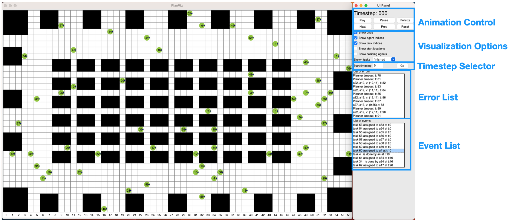
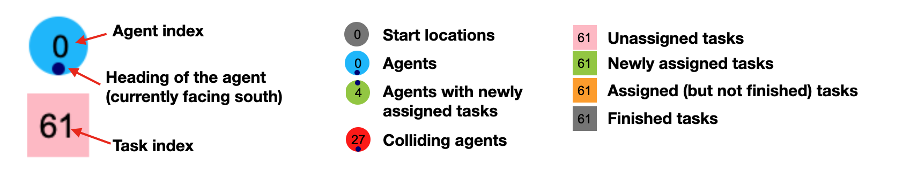
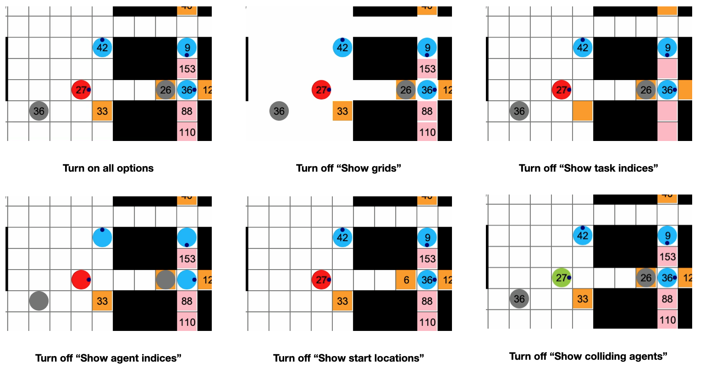
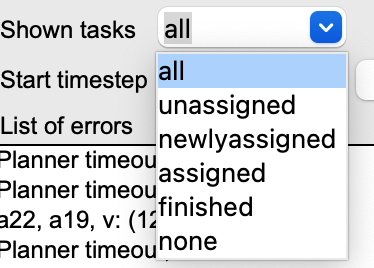
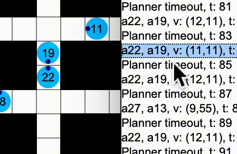

# Debug and Visualise Your Planner
The output file provides some related information to help you design and debug your planner. 
Begin by familiarizing yourself with the structure of the output JSON file. Please refer to the [Input_Output_Format.md](./Input_Output_Format.md).

## Debug your planner using Output File
To debug your planners, there are some properties that can help you to learn how your planner coordinate the robots. Here are some suggestions that you might be interested to look at: 
1. Check for Validity: Inspect the `errors` and `AllValid` properties to identify and address any invalid actions.
2. Review Paths: Study the `plannerPaths` and `actualPaths` results to check whether your planner behaves consistently with your expectations or not.
3. Analyze Planner Times: Look at the `plannerTimes` property to understand the time taken by your planner during each planning episode. Investigate further if you notice significant deviations from expected planning times.
4. Other ways: you can also compare your performance and design a better planner by simply looking at the `numTaskFinished` results and analysing the tasks finished by `events` and `tasks`.

## Visualise your planner using Output File
We also provide a tool called [PlanViz](https://github.com/MAPF-Competition/PlanViz) for visualising your plan with the output JSON file.
PlanViz shows the animation of the actualPaths of agents in the JSON file.
While the actual paths are always valid and conflict-free, the plannerPaths might contain conflicts and invalid moves.
In such cases, PlanViz can highlight the problematic agents with red color.
You can also click each item in the error list to jump to the corresponding timestep.
Note that PlanViz does not do any validation or error checking.
Therefore, the errors it shows are those recorded in the JSON file.
If you modify the JSON file manually, the error list and agent highlighting can be inconsistent with the movement.

For more details, please refer to the [Visualiser Page](https://github.com/MAPF-Competition/PlanViz).

### Use PlanViz

Following the instruction in the [Visualiser Page](https://github.com/MAPF-Competition/PlanViz), one can start PlanViz by running the following command
```
python3 plan_viz.py --map ../example/warehouse_small.map --plan ../example/warehouse_small.json --grid --aid --static --ca
```
You will see something similar to the figure below:



The UI of PlanViz consists of a main canvas, which shows the visualization, and a UI panel, which users can interact with. In the main canvas, we use the following markers to represent agents and tasks:



We will explain the UI panel in five sections: Animation Control, Visualization Options, Timestep Selector, Error List, and Event List. For instructions on how to debug errors, see the [error list section](#errorlist).

#### Animation Control
The animation control section shows the current timestep in the visualization and provides buttons for controlling the animation. You can use `Play/Pause` to start/stop the animation and `Next/Prev` to make agents move one step forward/backward.


#### Visualization Options

The visualization option section allows users to choose what to be displayed in the main canvas:



Note that, when "Show colliding agents" is turned on, an agent will be marked as always red if it has a collision in any timestep. You can also use the drop-down list of shown tasks to select which tasks to display:


#### Timestep Selector 
The timestep selector section allows users to jump to a specific timestep. Note that you need to pause PlanViz before using it.

<h4 id="errorlist">
Error List
</h4>

The error list section shows the errors (planner timeout, collisions in the planned paths, etc.) in the JSON input file. You can interact with a collision error by single or double-clicking it:



*When "Show colliding agents" is turned off, single-clicking a conflict will mark the two colliding agents red.*


*Double-clicking a conflict will make PlanViz jump to the specific timestep and show the collision.*
#### Event List

The event list section shows the events (assignment and completion of tasks) in the JSON input file. Single-clicking an event will make PlanViz jump to the timestep right before the event timestep.
