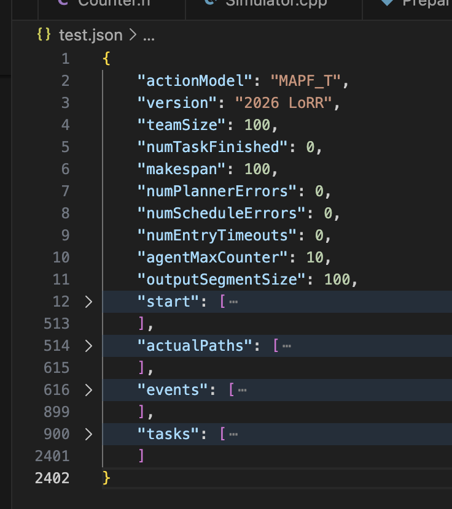

## Input Arguments

| Option | Type | Description |
|---|---:|---|
| `--help` |  | Show help message. |
| `--inputFile` / `-i` | String | Path to the input problem JSON file (**required**). |
| `--output` / `-o` | String | Output JSON path (default: `./output.json`). |
| `--prettyPrintJson` | Bool | Pretty-print the output JSON instead of writing it on one line (default: `false`). |
| `--outputScreen` / `-c` | Int | Output verbosity for the output JSON file: `1` = full output; `2` = only summary stats, actual plans and task finish events; `3` = only summary stats (omit events/tasks/errors/plannerTimes/starts/paths). |
| `--logFile` / `-l` | String | Redirect logs to this file (optional). |
| `--logDetailLevel` / `-d` | Int | Log level for the log file: `1` = all, `2` = warnings+fatal, `3` = fatal only. |
| `--fileStoragePath` / `-f` | String | Large file storage path. If empty, reads `$LORR_LARGE_FILE_STORAGE_PATH`. |
| `--simulationTime` / `-s` | Int | Maximum number of **execution ticks** to simulate (planning horizon). |
| `--preprocessTimeLimit` / `-p` | Int (ms) | Preprocessing time limit (loading / precomputation before simulation). |
| `--actionMoveTimeLimit` / `-a` | Int (ms) | **Execution tick** duration / per-tick time budget. The executor is called every tick under this budget. |
| `--initialPlanTimeLimit` / `-n` | Int (ms) | Time budget for the **first** planning call (default `1000`). |
| `--planCommTimeLimit` / `-t` | Int (ms) | Minimum communication interval between planning updates (default `1000`). The planner is called periodically, not every tick. |
| `--executorProcessPlanTimeLimit` / `-x` | Int (ms) | Time budget for processing/staging a returned plan (default `100`). |
| `--outputActionWindow` / `-w` | Int | Path output compression window size (default `1000`). Output paths are chunked in windows of this many ticks. |
| `--evaluationMode` / `-m` | Bool | Evaluate an existing output file (used by tooling / evaluation scripts). |
| `--plannerPython` | Bool | Use a Python `MAPFPlanner` implementation instead of the C++ one (default `false`). |
| `--schedulerPython` | Bool | Use a Python `TaskScheduler` implementation instead of the C++ one (default `false`). |
| `--executorPython` | Bool | Use a Python `Executor` implementation instead of the C++ one (default `false`). |
| `--disableStagedActionValidation` | Flag | Disable validation that executor staged actions remain a prefix of the previous staged actions plus the new plan (default off). |

## Input Problem File (in JSON format)

All paths here is the relative path relative to the location of input JSON file

| Property | Type | Description |
|---|---:|---|
| `mapFile` | String | The relative path to the file that describes the grid environment input. We use the grid map format as described in the next section (with a section link to the relevant section) |
| `agentFile` | String | String   The relative path to the file that describes the start locations for robots. The first line indicates the number of robots n. The following n lines correspond to the start locations of the n robots..* |
| `taskFile` | String | The relative path to the file that describes the locations for tasks. The first line indicates the number of tasks m. The following m lines contain multiple integers that each corresponds to a location of the task on the grid,\* and the order of locations on the same line specifies the order of locations that should be completed for this task |
| `delayConfig` | Object | Inline configuration for runtime delay generation. See the `delayConfig` fields below. |
| `teamSize` | Int | The number of robots in the simulation  |
| `numTasksReveal` | Float | The multiplier of tasks revealed in the task pool. We always keep numTasksReveal times teamSize of tasks revealed in the task pool. If in one timestep, k tasks are finished, then the system will add k tasks into the task pool |
| `agentSize` | Float | Size of the robot safety square for overlap-based collision checking (default `1.0`). Must be > 0. |
| `agentCounter` | Int | Number of execution ticks required to complete one **Forward/Rotate** action (default `10`). |                                                                                                                                                                                   |

Example input shown below:

### Notes on timing behavior (two-rate loop)

- The simulator advances **every execution tick** (fast loop).
- The planner is called **periodically** (slow loop), with at least `planCommTimeLimit` ms between plan updates.
- If a planning call is late, the simulation continues using the most recently accepted staged actions (robots may effectively wait if no staged actions are available).

### `delayConfig` fields

| Field | Type | Description |
|---|---:|---|
| `seed` | Int | Deterministic seed used by the runtime delay generator. |
| `minDelay` | Int | Minimum sampled delay duration. |
| `maxDelay` | Int | Maximum sampled delay duration. |
| `eventModel` | String | Delay event model: `bernoulli` or `poisson`. |
| `pDelay` | Float | Per-agent delay probability. For `bernoulli`, it is sampled independently for each available agent. For `poisson`, the runtime derives the Poisson rate as `teamSize * pDelay`. |
| `durationModel` | String | Delay duration model: `uniform` or `gaussian`. |
| `gaussMeanRatio` | Float | Relative mean position inside `[minDelay, maxDelay]` when using the `gaussian` duration model. |
| `gaussStdRatio` | Float | Relative standard deviation inside `[minDelay, maxDelay]` when using the `gaussian` duration model. |

For participant code at runtime, the shared environment exposes only the model names via `env->delay_event_distribution` and `env->delay_time_distribution`. The numeric `delayConfig` parameters are not exposed through `SharedEnvironment`.

## Map File Format

\* We linearize the a 2-D coordinate and use a single integer to represent a location. Given a location (row,column) and the map height (total number of rows) and width (total number of columns), the linearized location = row*width+column.

All maps begin with the lines:

> type octile  
> height y  
> width x  
> map  

Map Symbols:
| symbols                |                                                                                                                                                                                                                                                |
|------------------------|------------------------------------------------------------------------------------------------------------------------------------------------------------------------------------------------------------------------------------------------|
| @                      | hard obstacle.                                                                                                                                                                  |
| T                      | hard obstacle (for 'trees' in game environment).                                                                                                                                                                  |
| .                      | free space |
| E                      | emitter point (for ‘delivery’ goal) - traversable              |
| S                      | service point (for ‘pick up’ goal) - traversable                                                                                                                                                                                                        |

## Output File (in JSON format)

The output file of `./lifelong` is a JSON file consisting of the planner output, actual paths of robots, and the statistics.

The following table defines the properties that appear in the output file.

| properties      |                                                                                                                                                                                                                                                                                                                                                                                 |
|-----------------|---------------------------------------------------------------------------------------------------------------------------------------------------------------------------------------------------------------------------------------------------------------------------------------------------------------------------------------------------------------------------------|
| actionModel     | String   The name of the action model used for the robots in the simulator, this value is always "MAPF_T" which indicates MAPF with Turnings (i.e. robots can be orientated in any of the 4 cardinal directions, the avaliable actions are forward, clockwise turn, counter-clockwise turn, and wait)                                                                                                                                                                                                                                                                                                  |
| teamSize        | Int   The number of robots in the simulation                                                                                                                                                                                                                                                                                                                                                     |
| agentMaxCounter | Int | The `agentCounter` used in this run (ticks per Forward/Rotate action) |
| outputSegmentSize | Int | Segment/window length used for compressed path output |
| delayIntervals | List | A list of `n` per-agent delay interval lists, where `n` is the number of robots. Each interval is stored as `[start_timestep, end_timestep]`. Included only when `outputScreen <= 2`. |
| start           | List  A list of start locations. The length of the list is the number of robots.                                                                                                                                                                                                                                                                                           |
| numTaskFinished | Int  Number of finished tasks.                                                                                                                                                                                                                                                                                                                                             |
| sumOfCost       | Int                                                                                                                                                                                                                                                                                                                                                                        |
| makespan        | Int  Simulation Horizon                                                                                                                                                                                                                                                                                                                                                    |
| actualPaths | List | A list of `n` compressed path strings (executed behavior), where `n` is the number of robots. (only when `outputScreen <= 2`) |
| plannerPaths | List | A list of `n` compressed path strings (planned/staged behavior). (only when `outputScreen <= 1`) 
| plannerTimes    | List  A list of compute times in seconds during each planning episode of the entry.                                                                                                                                                                                                                                                                          |
| errors          | List  A list of action errors. Each error is represented by a list [task_id, robot1, robot2, timestep, description] where robot1, robot2, and timestep are integers and description is a string. robot1 and robot2 correspond to the id of robots that are involved in the error (robot2=-1 in case there is only one robot involved). The description is a message for the error.  |
| actualSchedule | List   A list of n strings, where n is the number of robots. Each string represents a new/renewed (valid) first task schedule and the time it changes, which is separated by ",". For each task schedule, the time and task schedule are separated by ":" and the task schedule, which contains the first task of the agent, i.e., "0:0,5:3," means for an agent, task 0 is scheduled as the first task of the agent at timestep 0 and task 3 is scheduled as the first task of the agent at timestep 5|
| plannerSchedule | List   A list of n strings, where n is the number of robots. Each string represents a new/renewed (valid or invalid) task schedule the taskScheduler propsoed and the time it changes, which is separated by ",". |
| events          | List  A list of (task) events. Each event is represented by a list [timestep, agent_id, task_id, sequence_id], they are all integers.  The sequence_id indicates the progress of the task and which errand in the task the agent is moving towards, also indicating how many errands in this task are finished.                                                                                                                  |
| scheduleErrors          | List  A list of schedule errors. Each error is represented by a list [task_id, robot1, robot2, timestep, description] where task_id robot1, robot2, and timestep are integers and description is a string. robot1 and robot2 correspond to the id of robots that are involved in the error (robot2=-1 in case there is only one robot involved). The description is a message for the error.  |
| tasks           | List  A list of tasks. Each task is represented by a list of multiple integers representing each location of the task [id, release_time, errand_sequence], errand_sequence is a list of errand locations: [x1,y1,x2,y2, ... ... ]|
| numPlannerErrors | Int   The number of planner errors (invalid actions). |
| numScheduleErrors | Int   The number of schedule errors (invalid schedules). |
| numEntryTimeouts | Int   The number of entry timeouts. |

Example output shown below:

### Path string format (`actualPaths` and `plannerPaths`)

Each robot path is encoded as a sequence of **segments** (windows). A segment has:

- a snapshot state at the start of the segment, and
- a list of `(action, duration)` pairs that compress repeated actions (e.g., FW10 means FW actions for 10 times).

Segment format:

`[(t,row,col,ori,counter):(A d, A d, ...)]`

Where:
- `t` is the segment start timestep (execution tick)
- `(row, col, ori, counter)` is the snapshot at the start of the segment
- each `(A d)` means action `A` applied for `d` consecutive ticks

Multiple segments are concatenated in the string to represent the full run.

### Delay interval format (`delayIntervals`)

`delayIntervals` is a list with one entry per robot. Each robot entry is a list of delay intervals:

`[[start_timestep, end_timestep], ...]`

Where:
- `start_timestep` is the execution tick when the delay starts
- `end_timestep` is the execution tick when the delay ends

Example:

`[[], [[12, 15], [40, 42]], [[7, 9]]]`

This means:
- robot 0 had no delays
- robot 1 was delayed during intervals `[12, 15]` and `[40, 42]`
- robot 2 was delayed during interval `[7, 9]`
