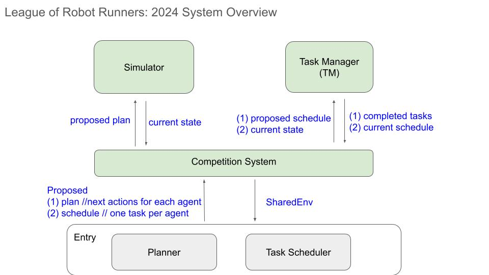

# Prepare Your Entry
To run the program, please refer to [README.md](./README.md) to download the start-kit and compile. 


## System Overview



The image shows the system overview of the start-kit.
At each timestep:
1. the competition system calls the `Entry` for the proposed schedule and plan, providing the `SharedEnv` that stores the current state of the robots and schedule. Internally, `Entry` calls `Scheduler` to compute the proposed schedule and calls `Planner` to compute the proposed plan.
2. Once `Entry` returns, the proposed plan will be passed to the Simulator for validation, and the Simulator will execute the plan and return the resulting state (current state) if the proposed plan is valid. 
3. The current state and proposed schedule are then passed to the Task Manager to validate the proposed schedule and check which, if any, tasks are progressed or completed. The Task Manager also reveals new tasks to the system. 
4. Then the returned current schedule, current state, revealed tasks and other information will be passed to `Entry` through `SharedEnv` at the next timestep.

### Important concepts

Before you start, get familiar with the following concepts in the code base:
- Coordination system: the location of a robot on the map is a tuple (x,y), where x refers to the row the robot is located in, and y refers to the corresponding column. For the first row (the topmost row), x = 0, and for the first column (the leftmost column), y = 0. You can find a visualization [here](./image/coordination_system.pdf)
- Map: the map is a vector of `int`, the index is calculated by linearise the (row, column) of a location to (row * total number of columns of the map) + column, the value is either 1: non-traversable or 0: traversable.
- `State` (defined in `inc/States.h`): a state containing the current location (map location index), current timestep and current facing orientation (0:east, 1:south, 2:west, 3:north).
- `Task` (defined in `inc/Tasks.h`): A task contains a list of multiple errands, which is stored in `locations`, the id `task_id`, the id of assigned robot `agent_assigned` and the index of the next unfinished errand `idx_next_loc`. Each errand is a single location on the map and should be visited one by one in order.
  A task can be reassigned to a different robot if its first errand has not been completed (i.e. `idx_next_loc=0`).
  However once a robot **opens** its assigned task (i.e., completes the first errand of the task), the task cannot be re-assigned to other robots.
- `Action` enum (defined in `inc/ActionModel.h`): the four possible actions are encoded in our start actions as: FW - forward, CR - Clockwise rotate, CCR - Counter clockwise rotate, W - Wait, NA - Unknown actions
- The `Entry` class acts as an interface to communicate with the start-kit main simulation. At each timestep, the main simulation will call the compute() function of Entry to get the next task and the next schedule for each robot to proceed. The compute function of the Entry will call the task scheduler to schedule the next task for each robot first and call the planner to plan the next actions.

  
### SharedEnv
The `SharedEnvironment` API provides the necessary information for you to compute schedule and actions. This data structure (defined as `env` in `inc/MAPFPlanner.h`, `inc/Entry.h`, and `inc/TaskScheduler.cpp`) describes the simulated setup and the state of the current timestep:
-  `num_of_agents`: `int`, the total team size.
-  `rows`: `int`, the number of rows of the map.
-  `cols`: `int`, the number of columns of the map.
-  `map_name`: `string`, the map file name.
-  `map`: vector of `int`, stores the map.  
-  `file_storage_path`: `string`, used for indicating the path for file storage, refer to section 'Local Preprocessing and Large Files'.
-  `goal_locations`: vector of vector of `pair<int,int>`: current goal location of each robot, which is the first unfinished errand of the scheduled task. The first int is the goal location, and the second int indicates the timestep that the task was allocated.
-  `current_timestep`: `int`, the current timestep according to the simulator. *Please be aware that current_timestep may increment during a `plan()` call. This occurs when a planner exceeds the time limit for a given timestep*
-  `curr_states`: vector of `State`, the current state for each robot at the current time step.
-  `plan_start_time`: `chrono::steady_clock::time_point`, stores the exact time `Entry::compute()` was called, the `Entry::compute()` should return proposed plan and schedule no more than `time_limit` ms following the plan_start_time.
- `curr_task_schedule`: `vector<int>`, the current schedule return by the Task Manager. `curr_task_schedule[i]` indicates the `task_id` scheduled for robot `i`. `-1` indicates a robot has no scheduled task.
- `task_pool`: `unordered_map<int, Task>`, this `unordered_map` stores all revealed but unfinished tasks, using `task_id` as keys.
- `new_tasks`: `vector<int>`, the `task_id` of the newly revealed tasks at the current timestep.
- `new_freeagents`: `vector<int>`, the `id` of the newly freed robots (robots have their tasks completed) at the current timestep.

  
## Entry Integration


### Understand the default entry
In `src/Entry.cpp`, you can find the default implementation for entry. In the `Entry::compute()` function, the default entry calls the default scheduler first. After the scheduler finishes, robots might be assigned new tasks and their goal locations (next errand of the scheduled task of each robot) are stored in `env->goal_locations` for planner reference.
Then, the entry calls the default planner to compute the actions for robots.
The time limit is revealed to both the default scheduler and planner. Inside the default scheduler and planner, you can see each of them using half amount of the time limit.

#### The default scheduler
In `src/TaskScheduler.cpp`, you can find the default task scheduler, which calls functions that are further defined in `default_planner/scheduler.cpp`.
- The preprocessing function of the default scheduler (see `schedule_initialize()` in `scheduler.cpp`) calls the `DefaultPlanner::init_heuristics()` function (see `default_planner/heuristics.cpp`) to initialize a global heuristic table, which will be used to store the distances between different locations. These distances are computed on demand during the simulation. The scheduler uses these distances to estimate the completion time of a given task for a given robot.
- The scheduling function of the default scheduler (see `schedule_plan()` in `scheduler.cpp`) implements a greedy scheduling algorithm: Each time when the `schedule_plan()` function is called, it iterates over each robot that does not have an assigned task. For each iterated robot, the algorithm iterates over tasks that are not assigned to any robot and assigns the one with minimal makespan (the distance to travel from the robot's current location through every errand of the task) to the robot.

#### The default planner
In `src/MAPFPlanner.cpp`, you can find the default planner implementation, which calls the functions that are further defined in `default_planner/planner.cpp`. The default planner shares the same heuristic distance tables with the default scheduler. Its `initialize()` function prepares necessary data structures and a global heuristic table (if not initialized by the scheduler). Its `plan()` function computes collision-free actions for the current timestep.

The MAPF planner implemented in the default planner is a variant of Traffic Flow Optimised Guided PIBT, [Chen, Z., Harabor, D., Li, J., & Stuckey, P. J. (2024, March). Traffic flow optimisation for lifelong multi-agent path finding. In Proceedings of the AAAI Conference on Artificial Intelligence (Vol. 38, No. 18, pp. 20674-20682)](https://ojs.aaai.org/index.php/AAAI/article/view/30054/31856). The planner first optimises traffic flow assignments for each robot, then computes collision-free actions using [Priority Inheritance with Backtracking](https://www.sciencedirect.com/science/article/pii/S0004370222000923) (PIBT) following the optimised traffic flow. A more detailed technical report will be provided soon.

> ⚠️ **NOTE** ⚠️, the default planner is an anytime algorithm, meaning the time it has to compute a solution directly impacts the quality of that solution. 
When a small amount of time is allocated, the default planner behaves like vanilla PIBT. When more time is allocated, the default planner updates traffic cost and incrementally recomputes guide paths for agents to improve their arrival time.
If you are a Scheduling Track participant, remember that the sooner your `schedule_plan()` function returns, the more time is avaliable to the default planner.
Better plans and better schedules can both substantially influence the performance of your submission on the leaderboard. 
How to allocate time between these two components is an important part of a successful strategy.

## What to implement for each track

- Scheduling Track:
You need to implement your own scheduler, which will work with the default planner. Check out the [Implement your scheduler](./Prepare_Your_Submission.md#implement-your-scheduler) section for more details.

- Planning Track:
You need to implement your own planner, which will work with the default scheduler. Check out the [Implement your planner](./Prepare_Your_Submission.md#implement-your-planner) section for more details.

- Combined Track:
You need to implement your own planner and scheduler. You can also modify the entry to meet your needs. Check out [Implement your planner](./Prepare_Your_Submission.md#implement-your-planner), [Implement your scheduler](./Prepare_Your_Submission.md#implement-your-scheduler) and [Implement your entry](./Prepare_Your_Submission.md#implement-your-entry) for more details.

### Implement your scheduler

If you are only competing in the scheduler track, you can ignore [Implement your planner](./Prepare_Your_Submission.md#implement-your-planner) and [Implement your entry](./Prepare_Your_Submission.md#implement-your-entry). 
Instead, read [Entry Integration](./Prepare_Your_Submission.md#Entry-Integration) to understand how the default planner and default Entry work.

The starting point for implementing your scheduler is to look at the files `src/TaskScheduler.cpp` and `inc/TaskScheduler.h`.
- Implement your own preprocessing function `TaskScheduler::initialize()`. 
- Implement your own scheduling function `TaskScheduler::plan()`. The inputs to the `plan` function are a time limit and a reference to a vector of integers as the resulting schedule. The ith integer in the result scheduler is the index of the task assigned to the ith robot.
- Don't change the definitions for the `TaskScheduler::initialize()` and `TaskScheduler::plan()` functions. Except for this, you are free to add new members/functions to the `TaskScheduler` class.
- Don’t override any operating system-related functions (signal handlers)
- Don’t interfere with the running program -- stack manipulation etc

At each timestep, the scheduler can access the `SharedEnvironment` API to read which tasks can be assigned to robots in `env->task_pool`.
The scheduler should return one task schedule per robot to the simulator environment. The schedule are written into the `proposed_schedule` vector, which is the input parameter of `plan()` function. A schedule `proposed_schedule[i]` for robot `i` is the `task_id` of a open task. A schedule is invalid if:
- one task is assigned to more than one agent,
- it includes completed task,
- a task already opened by an agent is reassgned to another agent.
Additionally, assigning `task_id` `-1` to an agent to indicate no assigned task. This drops any existing but unopened task. However, assign `-1` to an agent with opened task leads to an invalid schedule error.

  
If the scheduler returns invalid `proposed_schedule`, the `proposed_schedule` will be rejected and `current_schedule` remain unchanged.


### Implement your planner

If you are only competing in the planner track, you can ignore [Implement your scheduler](./Prepare_Your_Submission.md#implement-your-scheduler) and [Implement your entry](./Prepare_Your_Submission.md#implement-your-entry). 
Instead, read [Entry Integration](./Prepare_Your_Submission.md#Entry-Integration) to understand how the default scheduler and default Entry work.

The starting point of your implementation is the file `src/MAPFPlanner.cpp` and `inc/MAPFPlanner.h`. See examples in `src/MAPFPlanner.cpp`
- Implement your preprocessing in the function `MAPFPlanner::initialize()` that is provided to you. 
- Implement your planner in the function `MAPFPlanner::plan()` that provided to you
- Don't change the definitions for the `MAPFPlanner::initialize()` and `MAPFPlanner::plan()` functions. Except for this, you are free to add new members/functions to the `MAPFPlanner` class.
- Don’t override any operating system-related functions (signal handlers)
- Don’t interfere with the running program -- stack manipulation etc

At the end of each planning episode, you return one `Action` per robot to the simulator environment. The actions are written into the `actions` vector, which is input to the `plan()` function as a reference. `actions[i]` should be a valid `Action` for robot `i` which do not move the agent to obstacles and do not raise edge or vertex conflict with any other robot. If the planner returns any invalid `Action`, all agents wait at this timestep.
 
Similar to the scheduler, the planner can access the `SharedEnvironment` API. You need to use this API to read the current state of the system. The default `Entry` implementation writes next goal locations of agents with assigned tasks in `env->goal_locations`. The planner could refer to these goal locations to compute the next actions for the agents. The planner could also access the `env->curr_task_schedule` to know the detailed task schedule and task details.

### Implement your entry
For participants that compete in the combined track, you can modify the `Entry`, `MAPFPlanner`, and `TaskScheduler` freely to meet your needs.
You need to implement your own `Entry::initialize()` and `Entry::compute()` functions and are not allowed to change their definitions. Except for this, you are free to add new members/functions to the `Entry` class.
The `Entry::compute()` needs to compute the task schedule and the actions for robots. Although the default entry does this by calling the scheduler and the planner separately, this is not required.
If you compete in the combined track, you are allowed to modify the `Entry::compute()` function.

### Timing parameters for default planner and scheduler

At every timestep, we will ask your planner to compute the next valid action for each robot subject to a given `time_limit` in ms. The `time_limit` is given as an input parameter to the `compute()` function of `Entry.cpp`, which is then passed to `TaskScheduler::plan()` and `MAPFPlanner::plan()`. Note that, for `TaskScheduler::plan()` and `MAPFPlanner::plan()` the start time of the current timestep begins at `env->plan_start_time`, indicating the scheduler and the planner should return actions before `env->plan_start_time` plus `time_limit` ms. This is a soft limit, which means if you do not return actions before the `time_limit` elapses, the simulator will continue, and all robots will wait in place until the next planning episode.

The default scheduler and default planner run in a sequential manner. The default scheduler uses `time_limit/2` as the timelimit to compute schedules.
The default planner uses the remaining time, after the scheduler returns, to compute collision-free actions.

You still have some control over the timing behaviour of the default scheduler and default planner.
File `default_planner/const.h` specifies a few parameters that control the timing of the scheduler and planner:
- `PIBT_RUNTIME_PER_100_AGENTS` specifies how much time in ms is required for PIBT to compute collision-free actions per 100 robots. The default planner computes the end time for traffic flow assignment by subtracting PIBT action time from the time limit so that the remaining time is left for PIBT to return actions.
- `TRAFFIC_FLOW_ASSIGNMENT_END_TIME_TOLERANCE` specifies the traffic flow assignment process end time tolerance in ms. The default planner will end the traffic flow assignment phase this many milliseconds before the traffic flow assignment end time.
- `PLANNER_TIMELIMIT_TOLERANCE` The MAPFPlanner will deduct this value from the time limit for the default planner.
- `SCHEDULER_TIMELIMIT_TOLERANCE` The TaskScheduler will deduct this value from the time limit for the default scheduler.

You are allowed to modify the values of these parameters to reduce/increase the time spent on related components.

### Unmodifiable files

Except for the related implementation files for each track and some modifiable files stated in the following sections, most of the starter kit files are unmodifiable, and you must ensure that their functionalities are not interfered with. 
Please refer to [Evaluation_Environment.md](./Evaluation_Environment.md) for more details.


## Build

Once you implement your planner, you need to compile your submission for local testing and evaluation.
This section explains how the compilation system works and how to specify dependencies.

### Compile.sh

- The evaluation system will execute the `compile.sh` to build your program on the contest server.
- The evaluation system looks for and executes `./build/lifelong` for evaluation.
- Make sure your `compile.sh` result is an executable called `lifelong` under `build` folder.
- The `compile.sh` builds the C++ interface implementation on default. To build Python implementation (more on this below), remove the commands after `# build exec for cpp` and uncomment the commands after `# build exec for python`.
- You may adjust the `compile.sh` to match what your implementation needs.
- You are allowed to customize `compile.sh` and `CMakeLists.txt` based on your needs, but you must ensure that the starter kit functionalities are not interfered with and that all related features are compiled, especially those implemented in unmodifiable files.

### Dependencies

You are free to use third-party libraries or other dependencies in your implementation. You can do this in several ways:
- Include dependencies in your submission repo,
- Specify dependency packages in apt.txt. These packages must be available for installation through apt-get on Ubuntu 22.

## Python Interface
We also provide a Python interface for Python users based on pybind11.

Dependency: [Pybind11](https://pybind11.readthedocs.io/en/stable/)

The pybind11 bindings are implemented under `python/common`, `python/default_planner`, `python/default_scheduler`, `python/user_planner/`, and `python/user_scheduler/`.
These implementations allow the user-implemented Python scheduler to work with the default C++ planner and allow user implemented Python planner to work with the default C++ scheduler.
To use the Python interface, simply implement your planner and/or scheduler in:
+ `python/pyMAPFPlanner.py`: this file is where users implement their python-based MAPF planner algorithms and return actions as a list of actions for each robot.
+ `python/pyTaskScheduler.py`: this file is where users implement their python-based Task Scheduler algorithms and return proposed schedules as a list of task IDs for each robot.

### Track Config and Compiling

For each track of the competition, the start-kit uses a different combination of Python and C++ implementations:
- In Scheduler Track, the start-kit uses `Python scheduler` and `C++ default planner`.
- In Planner Track, the start-kit uses `Python planner` and `C++ default scheduler`.
- In Combined Track, the start-kit uses both `Python planner` and `Python Scheduler`.

When testing your implementation locally, you need to configure the correct track using the `./python/set_track.bash` under the root folder of the start-kit. The script will bring all necessary Python binding files to `./python/tmp` for compiling.

For combined track:
```shell
./python/set_track.bash combined
```
For scheduler track:
```shell
./python/set_track.bash scheduler
```
For planner track:
```shell
./python/set_track.bash planner
```

Then edit your compile.sh to make sure it uses only the following content:
```shell
mkdir build
cmake -B build ./ -DCMAKE_BUILD_TYPE=Release -DPYTHON=true
make -C build -j
```

Compile and test your implementation with:
```shell
./compile.sh
./build/lifelong --inputFile ./example_problems/random.domain/random_32_32_20_100.json -o test.json
```
Once compiled, the program looks for `pyMAPFPlanner` python module and `pyTaskScheduler.py` under `./python` or `../python` relative to the current working direction. Additionally, you can specify a path in `config.json` and use cmake flag `-DCOPY_PY_PATH_CONFIG=ON` (which copies the `config.json` to the target build folder), so that the problem will look for the `pyMAPFPlanner` in the specified folder.

Additionally, you can specify a specific Python version by `-DPYBIND11_PYTHON_VERSION` or an exact Python install by `-DPYTHON_EXECUTABLE`

For example:
```shell
cmake -B build ./ -DCMAKE_BUILD_TYPE=Release -DPYTHON=true -DPYBIND11_PYTHON_VERSION=3.6

#or

cmake -B build ./ -DCMAKE_BUILD_TYPE=Release -DPYTHON=true -DPYTHON_EXECUTABLE=path/to/python
```

Python packages can also be installed through `pip` on the evaluation server, thus you can specify the package you want to install in `pip.txt`.
For example, on the default `pip.txt` contains:
```
torch
pybind11-global>=2.10.1
numpy
```

## Evaluation

Once your planner is implemented and compiled, you are ready for local testing and evaluation.
The evaluation system uses official pytorch image [pytorch/pytorch:2.4.1-cuda11.8-cudnn9-devel](https://hub.docker.com/layers/pytorch/pytorch/2.4.1-cuda11.8-cudnn9-devel/images/sha256-ebefd256e8247f1cea8f8cadd77f1944f6c3e65585c4e39a8d4135d29de4a0cb?context=explore) as docker base image to build the evaluation environment, which have GPU driver, cuda, cudnn, and other essential GPU softwares ready. We officially support and tested `Pytorch` in this setup, other frameworks may or may not work in the evaluation environment.

Please refer to [Evaluation_Environment.md](./Evaluation_Environment.md) for more details.

### Local Testing
A variety of test problems are provided in the `example_problems` folder. Use any JSON input file there for testing.
Results of the evaluation are placed in a file at `--output_file_location` that you specified as a command line parameter.
For details about the format of input problems and output results refer to the documentation in [Input_Output_Format.md](./Input_Output_Format.md).

### Test in Docker
The evaluation system builds and execuates your implementation in a docker container which acts as a sandbox.
To make sure your implementation builds and runs as expected, you can build the docker container locally.

First, install the latest Docker release on your machine, [https://docs.docker.com/engine/install/](https://docs.docker.com/engine/install/).
Next, build your container using our provided `RunInDocker.sh` script. 
In the remainder of this section, we explain how the script works and how to use your docker container.

#### Using `RunInDocker.sh`

* In the root of your code base, run the command `./RunInDocker.sh`. This script will automatically generate a Dockerfile to build the Docker image based on `pytorch/pytorch:2.4.1-cuda11.8-cudnn9-devel`.
* However, image `pytorch/pytorch:2.4.1-cuda11.8-cudnn9-devel` only support linux/amd64 os/architecture. If you are using another os/architecture (e.g. MacOS with Arm CPUs) and do not use GPU, you could use [ubuntu:jammy](https://hub.docker.com/layers/library/ubuntu/jammy/images/sha256-58148fb210e3d70c972b5e72bdfcd68be667dec91e8a2ed6376b9e9c980cd573?context=explore) as a replacement, by running the script with a base image specified: `./RunInDocker.sh ubuntu:jammy`.
* It will copy your codes to the Docker Environment, install dependencies listed in `apt.txt` using apt-get and python packages in `pip.txt` using pip, and compile your code using `compile.sh`.
* You are inside the docker container when the script finishes.
* You can run the compiled program inside the Docker container now.
* The docker image name `<image name>` is `mapf_image` and the container name `<container name>` is `mapf_test`.
* The default working directory is `/MAPF/codes/`.
* You can now test and evaluate your implementation in the container
* Exit the container with the command: `exit`.

#### Start an existing container:
  * In the background: `docker container start <container name>`
  * Interactively: `docker container start -i <container name>`

#### Execute Commands Outside the Container
If the docker container is started in the background, you can run commands from the outside of the docker container (treat the docker container as executable).
 
  * Use prefix: `docker container exec <container name> `for any command you want to execute, for example:
  ```shell
  docker container exec mapf_test ./build/lifelong --inputFile ./example_problems/random.domain/random_20.json -o test.json
  ``` 
 
  * All outputs are stored inside the container. You could copy files from the Docker container. For example: `docker cp mapf_test:/MAPF/codes/test.json ./test.json`, which copies `test.json` to your current working directory.

## Preprocessing and Large File Storage

Prior to the start of each evaluation, we allow your entry having 30 minutes of preprocessing time per map to load supporting files and initialise supporting data structures. 
The `preprocess_time_limit` is specified as a parameter to your entry's `initialize()` function, which on default calls the `intialize()` function of MAPFPlanner and TaskScheduler. If your entry's preprocessing operations take longer than `preprocess_time_limit`, your planner fails and the simulation terminates with **exit code 124**. 

Please refer to the documentation in [Working_with_Preprocessed_Data.md](./Working_with_Preprocessed_Data.md) for more details.
