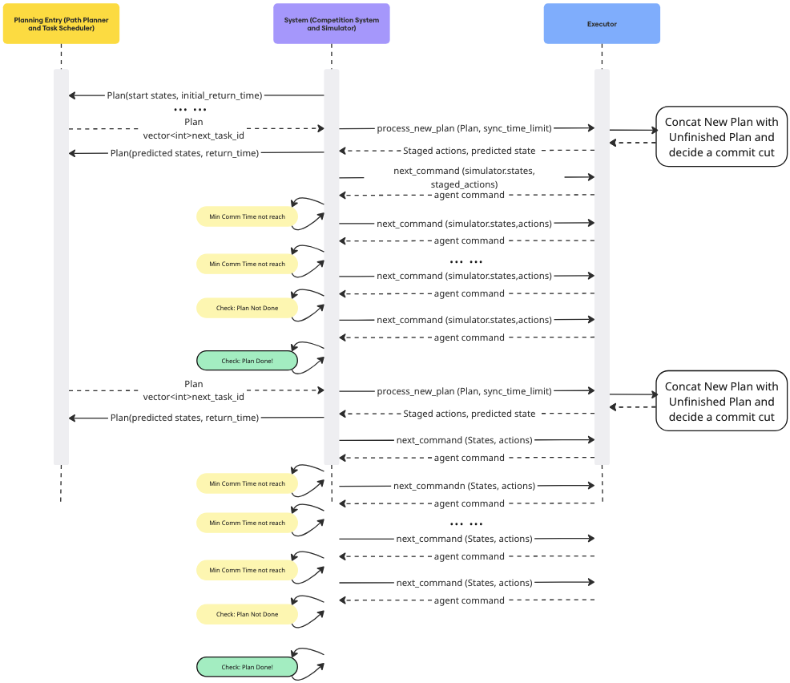

# Prepare Your Entry

To run the program, please refer to [README.md](./README.md) to download the start-kit and compile.

This document explains:
- how the competition system calls `Entry`, `Planner`, `Scheduler`, and the **Executor**,
- what data you receive in `SharedEnvironment`,
- what you are expected to return (schedule + **multi-step plan**),
- how timing / timeouts work in the **two-rate** (planner vs executor) loop,
- how to build and test locally.

---

## System Overview

The start-kit runs a **two-rate control loop**:

### A) Planning update (slow loop)
Periodically (every multiple execution ticks), the competition system:
1. syncs the latest environment info into `SharedEnvironment` (`env`),
2. calls `Entry::compute(time_limit, proposed_plan, proposed_schedule)`.

Inside `Entry::compute()` (default implementation in `src/Entry.cpp`):
- `TaskScheduler::plan()` produces `proposed_schedule`,
- `Entry::update_goal_locations()` updates `env->goal_locations`,
- `MAPFPlanner::plan()` produces `proposed_plan` (a **multi-step plan**, see below).

After `Entry::compute()` returns, the system:
3. calls the **Executor** to process the new plan and update per-agent `staged_actions` (the action queues that will be executed until the next plan update),
4. continues execution using those staged actions.

### B) Execution tick (fast loop)
Every execution tick (even while planning is running), the system:
1. calls the Executor to decide a per-agent execution command (GO/STOP),
2. converts GO/STOP + staged actions into **requested actions** for this tick,
3. applies delays (may force some agents to STOP/Wait),
4. simulates one tick of motion with the action model (continuous overlap-based collision handling),
5. updates robot states and task progress.


This image shows the interaction loop in the start-kit. The system calls `Entry::compute(...)` periodically to let the planner/scheduler return a **multi-step, grid-level** Plan and Task Schedule. The system then calls `Executor::process_new_plan(...)` to **stage** the new plan, merging it with any unfinished actions (respecting multi-tick **commitment**) and producing updated `staged_actions` (and optional predicted states). Meanwhile, every tick, the system calls `Executor::next_command(...)` to output per-agent **GO/STOP**, applies delays/safety checks, and advances the simulator.

---

## Important concepts (code-level)

Before you start, get familiar with the following concepts in the code base:

### Coordinate system
The location of a robot on the map is (row, col).
- row increases downward, starting from 0 at the top
- col increases rightward, starting from 0 at the left

See [coordination_system.pdf](./image/coordination_system.pdf).

### Map representation
The map is a `vector<int>` in row-major order.
Index of (row, col) is `row * cols + col`.
Cell value:
- `1` = obstacle (non-traversable)
- `0` = free (traversable)

### `State` (robot state)
Defined in `inc/States.h`.

Besides `(location, timestep, orientation)`, the state includes:
- `counter`: progress within the current action (`inc/Counter.h`)
- `delay`: whether the agent is currently delayed (`inc/Delay.h`)
- `moveType`: whether the agent is mid-transition or mid-rotation (`Transition / Rotation / None`)

This matters because actions may take **multiple ticks** to finish.

### `Task`
Defined in `inc/Tasks.h`.

A task is a sequence of errands (`locations`) that must be visited in order.
Fields include:
- `task_id`
- `agent_assigned`
- `idx_next_loc` (index of next unfinished errand)

A task can be reassigned only if its first errand is not completed (`idx_next_loc == 0`).
Once a robot opens a task (completes the first errand), it cannot be reassigned.

### Planner-level `Action`
Defined in `inc/ActionModel.h`:
- `FW`  (Forward)
- `CR`  (Clockwise rotate)
- `CCR` (Counter-clockwise rotate)
- `W`   (Wait)
- `NA`  (Not applicable / reserved; do not output in your plan)

**Planner actions are grid-level intent** (e.g., `FW` means “move toward the next cell”).

### Execution-level `ExecutionCommand`
Also defined in `inc/ActionModel.h`:
- `GO`   (allow progress this tick)
- `STOP` (pause this tick)

The executor outputs `GO/STOP` every tick; the simulator then applies the action model and safety rules.

### `Plan` and `staged_actions`
- `Plan` is defined in `inc/Plan.h`.
- A plan stores `plan.actions`, typed as `vector<vector<int>>`.

Interpretation:
- `plan.actions[i]` is a sequence of planner-level actions for agent `i`,
  encoded as integers corresponding to the `Action` enum (`FW=0, CR=1, CCR=2, W=3, ...`).

The executor converts the returned `Plan` into `staged_actions`:
- `staged_actions[i]` is a queue of actions that are ready to be executed for agent `i`.
- These staged actions are executed tick-by-tick until a new plan is adopted.

You can read the current staged actions in `env->staged_actions`.

Important Note: in the combined track, you can customise your `Plan`, but your executor also needs to be responsible for understanding the `Plan` and converting the `Plan` into a sequence of `Action`s to stage and pass to the system. In other words, the system will only accept the staged actions as a sequence of `Action`s defined in `inc/ActionModel.h`.

---

## SharedEnvironment (`SharedEnv`)

`SharedEnvironment` is defined in `inc/SharedEnv.h` and is available as `env`.

It contains:

### Static environment info
- `num_of_agents`, `rows`, `cols`
- `map_name`
- `map` (vector<int>)
- `file_storage_path` (for storing/loading auxiliary data)

### Time / execution parameters
- `plan_start_time`: timepoint when the system called `Entry::compute()`
- `min_planner_communication_time`: minimum time between plan updates (ms)
- `action_time`: time budget per execution tick (ms)
- `max_counter`: number of ticks needed to complete one action (FW/CR/CCR)

### Robot state views
This system exposes two useful “views” of robot states:

- `system_states`: the **current physical states** in the executor loop (tick-by-tick).
- `curr_states`: the **planning snapshot states** used for planning updates.
  These may be predicted/processed states (e.g., after staging a plan window),
  and may differ from `system_states`.

Also available:
- `system_timestep`: the current execution tick.
- `curr_timestep`: the starting timestep for the predicted states, set to 0.
- `staged_actions`: current per-agent action queues staged for execution.

### Task info
- `curr_task_schedule`: current schedule (agent -> task_id, or -1)
- `task_pool`: revealed but unfinished tasks (task_id -> Task)
- `new_tasks`: newly revealed tasks at this update
- `new_freeagents`: agents that just finished a task at this update
- `goal_locations`: per-agent next goal (derived from schedule; updated by Entry)

> Note: `system_timestep` may advance during `Entry::compute()` because the executor continues to tick while planning is running. Do not assume time is frozen during planning.

---

## Entry Integration

### Understand the default Planning Entry
Default Planning Entry is in `src/Entry.cpp`.

`Entry::compute(time_limit, plan, proposed_schedule)` runs:
1) scheduler: `TaskScheduler::plan(time_limit, proposed_schedule)`
2) goal update: `Entry::update_goal_locations(proposed_schedule)`
3) planner: `MAPFPlanner::plan(time_limit, plan)`

The scheduler and planner share the same `time_limit` and are called sequentially.
Both should budget time using `env->plan_start_time`.

### Understand the default Executor Entry
Default Executor Entry is in `src/Executor.cpp`. Details of the API will be illustrated in next section.

---

## Planner / Scheduler / Executor APIs (fixed)

These function signatures must not be changed:

### Scheduler
Files: `inc/TaskScheduler.h`, `src/TaskScheduler.cpp`
- `TaskScheduler::initialize(int preprocess_time_limit)`
- `TaskScheduler::plan(int time_limit, vector<int>& proposed_schedule)`

Return:
- `proposed_schedule[i] = task_id` or `-1` (no task)

Invalid schedule examples:
- same task assigned to multiple agents
- assigning completed/unrevealed/nonexistent tasks
- reassigning an already opened task to another agent
- assigning `-1` to an agent that already opened a task (invalid)

If a schedule is invalid or times out, the system keeps the previous valid schedule.

### Planner
Files: `inc/MAPFPlanner.h`, `src/MAPFPlanner.cpp`
- `MAPFPlanner::initialize(int preprocess_time_limit)`
- `MAPFPlanner::plan(int time_limit, Plan& plan)`

Return:
- `plan.actions[i]` = sequence of actions for agent `i` (multi-step plan)

**Multi-step plans are supported and recommended.**
If an agent runs out of staged actions, it will be STOPped until new actions are staged.

### Executor
Files: `inc/Executor.h`, `src/Executor.cpp`
- `Executor::initialize(int preprocess_time_limit)`
- `Executor::process_new_plan(int sync_time_limit, Plan& plan, vector<vector<Action>>& staged_actions)`
- `Executor::next_command(int exec_time_limit, vector<ExecutionCommand>& agent_command)`

Return:
- `process_new_plan(...)` updates `staged_actions` and returns predicted states.
- `next_command(...)` outputs `GO/STOP` per agent for the next tick.

The default executor provides a baseline policy and a default plan-staging strategy.

---

## How plans are received and executed (important)

### Plan staging window
The executor may choose to stage only part of the returned plan.
The default executor uses a “window” idea:
- it stages enough actions to cover roughly one planner communication interval.

This prevents staging far into the future when a new plan may arrive soon.

### When is a staged action consumed?
In the simulator, a staged action is removed from the front of the queue only when it is completed:
- `W` is consumed after one tick of waiting
- `FW` is consumed when the agent reaches the next cell center (location changes)
- `CR/CCR` is consumed when the orientation update completes (orientation changes)

If an agent is STOPped mid-action (or delayed), the action remains at the front and resumes later.

---

## Execution model (Counters, delays, and overlap-based safety)

### Multi-tick actions (counter)
`FW`, `CR`, and `CCR` take multiple execution ticks.
Progress is tracked by `State.counter`.
When the counter completes, the discrete location/orientation updates.

### Delays
During a delay tick, an agent is forced to Wait/STOP.
This pauses counter progress and may create congestion.

### Collisions and safety (no vertex/edge rules)
This branch does not use “vertex” or “edge” conflicts.
Instead, safety is enforced by geometric overlap:
- agents are modelled as axis-aligned squares (“safety bubbles”)
- obstacles are solid squares
- overlap is checked continuously over a tick (swept collision)

If an agent’s requested motion is unsafe, the action model may override it to `W` for that tick.
This override can happen per-agent (not necessarily “everyone waits”).

Practical implication:
- Your planner can output collision-free plans at the grid level, but the executor/action model
  is the final authority and may still STOP/WAIT agents due to continuous overlap constraints,
  delays, and dependency resolution.

---

## Timing and timeouts (what really happens)

There are several time budgets in the system:

### Preprocessing (hard limit)
`Entry::initialize(preprocess_time_limit)` and `Executor::initialize(int preprocess_time_limit)` are called before evaluation begins.
If any of the preprocessing exceeds this limit, the run terminates (exit code 124).

### Planning update time limit (soft limit)
`Entry::compute(time_limit, ...)` is time-bounded.
If it runs late:
- the executor continues ticking using the last accepted staged actions,
- the next plan update is delayed until the current planning call finishes.

In other words: late planning reduces how often your plan can be updated; the simulation does not freeze.

### Executor per-tick time limit (soft limit)
`Executor::next_command(exec_time_limit)` is called every execution tick.
If it is slow, you effectively lose execution time (the simulation may advance using safe waiting for all agents behaviour to compensate).
Keep `next_command` lightweight.

### Plan processing time limit (soft limit)
`Executor::process_new_plan(sync_time_limit, ...)` should also be efficient.
If it is slow, it will be treated similarly as planning late, which means the system will continue ticking and calling the next command without having new plans.

---

## What to implement for each track

(If your competition year uses different track naming, follow the website instructions; the APIs above remain fixed.)

- Scheduling Track: implement your scheduler; default planner + default executor run with it.
- Execution Track: implement your executor; default planner/scheduler provide intent.
- Combined Track: implement planner, scheduler and executor

You can also modify `Entry` in combined settings, but do not change API signatures.

### Timing parameters for default planner and scheduler

At every timestep, we will ask your planner to compute the next valid action for each robot subject to a given `time_limit` in ms. The `time_limit` is given as an input parameter to the `compute()` function of `Entry.cpp`, which is then passed to `TaskScheduler::plan()` and `MAPFPlanner::plan()`. Note that, for `TaskScheduler::plan()` and `MAPFPlanner::plan()` the start time of the current timestep begins at `env->plan_start_time`, indicating the scheduler and the planner should return actions before `env->plan_start_time` plus `time_limit` ms. This is a soft limit, which means if you do not return actions before the `time_limit` elapses, the simulator will continue, and all robots will wait in place until the next planning episode.

The default scheduler and default planner run in a sequential manner. The default scheduler uses `time_limit/2` as the timelimit to compute schedules.
The default planner uses the remaining time, after the scheduler returns, to compute collision-free actions.

You still have some control over the timing behaviour of the default scheduler and default planner.
File `default_planner/const.h` specifies a few parameters that control the timing of the scheduler and planner:
- `PIBT_RUNTIME_PER_100_AGENTS` specifies how much time in ms is required for PIBT to compute collision-free actions per 100 robots. The default planner computes the end time for traffic flow assignment by subtracting PIBT action time from the time limit so that the remaining time is left for PIBT to return actions.
- `TRAFFIC_FLOW_ASSIGNMENT_END_TIME_TOLERANCE` specifies the traffic flow assignment process end time tolerance in ms. The default planner will end the traffic flow assignment phase this many milliseconds before the traffic flow assignment end time.
- `PLANNER_TIMELIMIT_TOLERANCE` The MAPFPlanner will deduct this value from the time limit for the default planner.
- `SCHEDULER_TIMELIMIT_TOLERANCE` The TaskScheduler will deduct this value from the time limit for the default scheduler.

You are allowed to modify the values of these parameters to reduce/increase the time spent on related components.

### Unmodifiable files

Except for the related implementation files for each track and some modifiable files stated in the following sections, most of the starter kit files are unmodifiable, and you must ensure that their functionalities are not interfered with. 
Please refer to [Evaluation_Environment.md](./Evaluation_Environment.md) for more details.

---

## Build

Once you implement your planner, you need to compile your submission for local testing and evaluation.
This section explains how the compilation system works and how to specify dependencies.

### Compile.sh

- The evaluation system will execute the `compile.sh` to build your program on the contest server.
- The evaluation system looks for and executes `./build/lifelong` for evaluation.
- Make sure your `compile.sh` result is an executable called `lifelong` under `build` folder.
- The `compile.sh` builds the C++ interface implementation on default. To build Python implementation (more on this below), remove the commands after `# build exec for cpp` and uncomment the commands after `# build exec for python`.
- You may adjust the `compile.sh` to match what your implementation needs.
- You are allowed to customize `compile.sh` and `CMakeLists.txt` based on your needs, but you must ensure that the starter kit functionalities are not interfered with and that all related features are compiled, especially those implemented in unmodifiable files.

### Dependencies

You are free to use third-party libraries or other dependencies in your implementation. You can do this in several ways:
- Include dependencies in your submission repo,
- Specify dependency packages in apt.txt. These packages must be available for installation through apt-get on Ubuntu 22.

## Python Interface
Comming soon.

## Evaluation

Once your planner is implemented and compiled, you are ready for local testing and evaluation.
The evaluation system uses official pytorch image [pytorch/pytorch:2.4.1-cuda11.8-cudnn9-devel](https://hub.docker.com/layers/pytorch/pytorch/2.4.1-cuda11.8-cudnn9-devel/images/sha256-ebefd256e8247f1cea8f8cadd77f1944f6c3e65585c4e39a8d4135d29de4a0cb?context=explore) as docker base image to build the evaluation environment, which have GPU driver, cuda, cudnn, and other essential GPU softwares ready. We officially support and tested `Pytorch` in this setup, other frameworks may or may not work in the evaluation environment.

Please refer to [Evaluation_Environment.md](./Evaluation_Environment.md) for more details.

### Local Testing
A variety of test problems are provided in the `example_problems` folder. Use any JSON input file there for testing.
Results of the evaluation are placed in a file at `--output_file_location` that you specified as a command line parameter.
For details about the format of input problems and output results refer to the documentation in [Input_Output_Format.md](./Input_Output_Format.md).

### Test in Docker
The evaluation system builds and execuates your implementation in a docker container which acts as a sandbox.
To make sure your implementation builds and runs as expected, you can build the docker container locally.

First, install the latest Docker release on your machine, [https://docs.docker.com/engine/install/](https://docs.docker.com/engine/install/).
Next, build your container using our provided `RunInDocker.sh` script. 
In the remainder of this section, we explain how the script works and how to use your docker container.

#### Using `RunInDocker.sh`

* In the root of your code base, run the command `./RunInDocker.sh`. This script will automatically generate a Dockerfile to build the Docker image based on `pytorch/pytorch:2.4.1-cuda11.8-cudnn9-devel`.
* However, image `pytorch/pytorch:2.4.1-cuda11.8-cudnn9-devel` only support linux/amd64 os/architecture. If you are using another os/architecture (e.g. MacOS with Arm CPUs) and do not use GPU, you could use [ubuntu:jammy](https://hub.docker.com/layers/library/ubuntu/jammy/images/sha256-58148fb210e3d70c972b5e72bdfcd68be667dec91e8a2ed6376b9e9c980cd573?context=explore) as a replacement, by running the script with a base image specified: `./RunInDocker.sh ubuntu:jammy`.
* It will copy your codes to the Docker Environment, install dependencies listed in `apt.txt` using apt-get and python packages in `pip.txt` using pip, and compile your code using `compile.sh`.
* You are inside the docker container when the script finishes.
* You can run the compiled program inside the Docker container now.
* The docker image name `<image name>` is `mapf_image` and the container name `<container name>` is `mapf_test`.
* The default working directory is `/MAPF/codes/`.
* You can now test and evaluate your implementation in the container
* Exit the container with the command: `exit`.

#### Start an existing container:
  * In the background: `docker container start <container name>`
  * Interactively: `docker container start -i <container name>`

#### Execute Commands Outside the Container
If the docker container is started in the background, you can run commands from the outside of the docker container (treat the docker container as executable).
 
  * Use prefix: `docker container exec <container name> `for any command you want to execute, for example:
  ```shell
  docker container exec mapf_test ./build/lifelong --inputFile ./example_problems/random.domain/random_20.json -o test.json
  ``` 
 
  * All outputs are stored inside the container. You could copy files from the Docker container. For example: `docker cp mapf_test:/MAPF/codes/test.json ./test.json`, which copies `test.json` to your current working directory.

## Preprocessing and Large File Storage

Prior to the start of each evaluation, we allow your entry having 30 minutes of preprocessing time per map to load supporting files and initialise supporting data structures. 
The `preprocess_time_limit` is specified as a parameter to your entry's `initialize()` function, which on default calls the `intialize()` function of MAPFPlanner and TaskScheduler. If your entry's preprocessing operations take longer than `preprocess_time_limit`, your planner fails and the simulation terminates with **exit code 124**. 

Please refer to the documentation in [Working_with_Preprocessed_Data.md](./Working_with_Preprocessed_Data.md) for more details.
